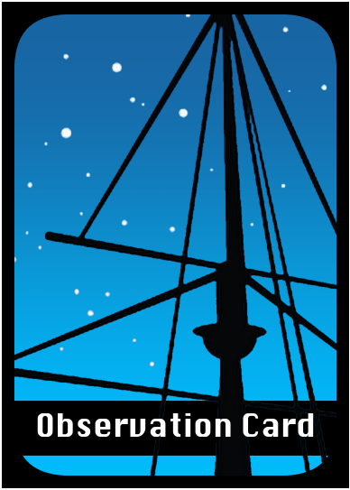
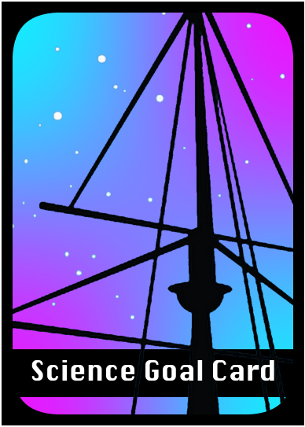
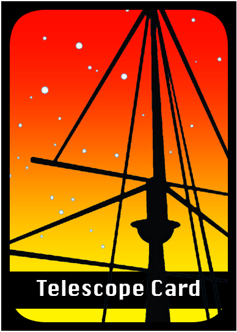
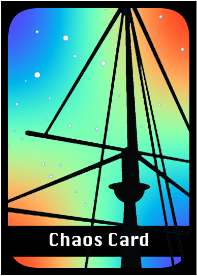
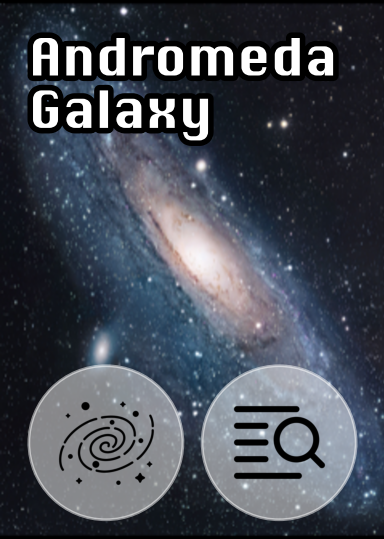
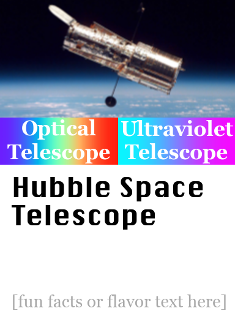
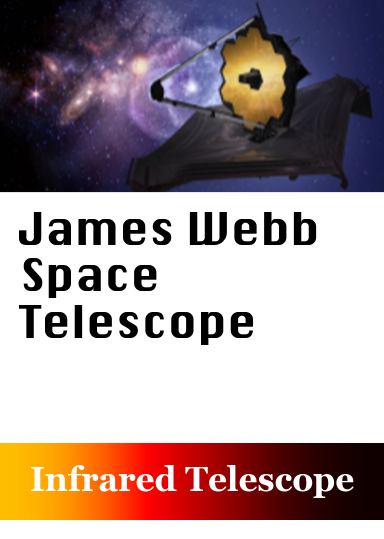
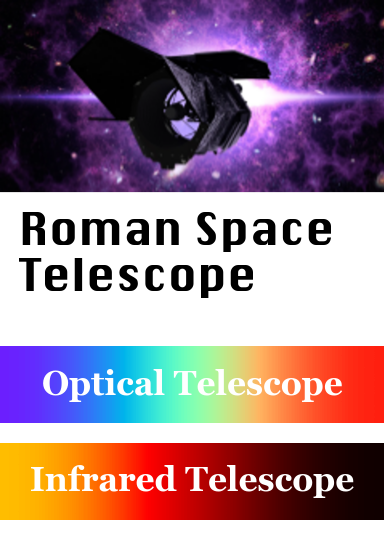

# MAST Match: The MAST Card Game

Welcome to the MAST Match project! MAST Match is an astronomical card game themed around the [Mikulski Archive for Space Telesopes (MAST)](https://archive.stsci.edu), the data archive which holds all the data for the Hubble Space Telescope, the James Webb Space Telescope, and many other missions. This game is fun for astronomers and the general public to play alike, and features real astronomical data stored in the MAST archive.

# !!! This project is a work in progress !!!
This repository is very incomplete. More will be coming eventually. 

### Print at Home

{link a pdf here so people can print their own copy}

# How to Play

MAST Match is a competitive card game in which each player curates their own data archive, like MAST, by collecting astronomical observations. 

The goal of the game is to make matching sets of Observation Cards, in order to complete your Science Goal Cards and earn points. Watch out though, because there's always a little chaos in astronomy - the unpredictable Chaos Cards can make or break your strategy! 

This section includes the instructions and rules for how to play MAST match, describing the different types of cards and how play proceeds on each turn.

## Types of Cards

There are four types of cards in the MAST Match game:

- *Observation Cards*: These cards represent astronomical data. They each have a "target type" and a "data type", similar to the suits of a classical card deck.
- *Science Goal Cards*: These cards represent research projects you are trying to complete to earn points. Each science goal requires a different combinaton of Observation Cards to complete.
- *Telescope Cards*: Telescope cards are used to collect Observation Cards. 
- *Chaos Cards*: These cards add a little unpredictability to the game. They can be good or bad, so use with caution!

The back of each card type looks like this:

Observation Cards | Science Goal Cards | Telescope Cards | Chaos Cards |
:-------------------------:|:-------------------------:|:-------------------------:|:-------------------------:
 |  |  | 

There are also a handful of "Rules" cards (with a gray back) for quick reference, but those are not used in play.

### Observation Cards

The majority of the cards in the deck are *Observation Cards*, which represent astronomical data. Each card has two symbols on it which represent its *Target Type* and *Data Type*. 

- *Target Type* What type of astronomical object this card represents: galaxy, star, nebula, or planet.
-  *Data Type*: What type of data file this card represents: an image, a spectrum, a time series, or a catalog.

Target Types             |  Data Types
:-------------------------:|:-------------------------:
  |  

Some example observation cards are displayed below:

Observation Card | Observation Card | Observation Card | Observation Card
:-------------------------:|:-------------------------:|:-------------------------:|:-------------------------:
  |    |   |  
Target Type: Nebula  |  Target Type: Galaxy |  Target Type: Planet |   Target Type: Star
Data Type: Image  |  Data Type: Catalog |  Data Type: Timeseries | Data Type: Timeseries

The goal of the game is to create matches of different combinations of targets and data, which you will earn points for with your Science Goal Cards.

### Science Goal Cards

Science Goal Cards are how you earn points towards winning the game. Each Science Goal Card is worth between 3-6 points, displayed in the center of the card. The requirements to complete the science goal are depicted on the bottom, using the same symbols of "Target Type" and "Data Type" as on the Observation Cards.

If the requirement symbols are not touching, they can be completed by separate cards. If the symbols are touching, you must use one card that has both requirements - for example, "The Dark Side" science goal shown below has to be completed using two Observation cards, which are both images of nebula. A spectrum of a nebula or a timeseries would not count towards this goal.

Each Science Goal also has a wavelength, which determines which telescope card must be used to gather the observations. For example, the Ultravriolet "A Star is Born" card has three "star" symbols on it, and can be completed by collecting a set of any three star observation cards with the Hubble Space Telescope, or another telescope in play which has ultraviolet capabilities.

Some example Science Goal Cards are shown below.

Science Goal Card | Science Goal Card | Science Goal Card 
:-------------------------:|:-------------------------:|:-------------------------:
  |     |   
This card requires one of each target type to complete and is worth 6 points |  This card requires any three *star* cards to complete and is worth 3 points. |  This card requires two images of nebulas to complete, and is worth 5 points.

### Telescope Cards

The telescope cards allow you to gather data and collect an Observation Card to add to your archive. Each telescope card has particular wavelengths it can observe in, which are depicted on the card. When collecting data, the wavelength on the telescope card must match the wavelength of one of the science goals you are trying to complete.

Some example telescope cards are displayed below:

Telescope Card | Telescope Card  | Telescope Card 
:-------------------------:|:-------------------------:|:-------------------------:
  |     |  
HST can be used to complete *Optical* or *Ultraviolet* goals. |  JWST can be used to complete *Infrared* science goals.  |  Roman can be used to complete *Infrared* or *Optical* science goals.

### Chaos Cards

Chaos cards are bonus cards that add a little extra chaos to the game! Their effects can be good or bad, so only draw one if you're feeling lucky!

Chaos Cards say either "Play immediately" or "Play Later", as denoted on the card. "Play Immediately" cards take effect as soon as you draw them, and you should play them face-up in front of you immediately and read them aloud to the group. "Play Later" cards can be read privately, and kept in your hand face-down until you decide to activate them. You can play a "Play Later" Chaos card at any time, even if it is not your turn. 

Some example chaos cards are displayed below:

Chaos Card | Chaos Card  | Chaos Card 
:-------------------------:|:-------------------------:|:-------------------------:
  |     |  

## Table Setup

### Pass out Science Goal Cards

Shuffle the Science Goal Cards and pass out 3 cards to each player, laying them face-up in front of each player. These will be your Science Goals to start.

Place the remaining deck face-down near the center of the table.

### Shuffle the Chaos Cards

Shuffle the Chaos Card deck and place it face-down near the center of the table.

### Set up the Visible Sky (Observation Cards)

Shuffle the Observation Cards and put the deck face-down near the center of the table. this will be the draw pile. Draw the top 6 cards, and place them face-up in a row next to the draw pile. This row of cards is called the Visible Sky, and represents which targets are visible in the night sky at any given time.

### Set up the Telescope row

[number of telescopes depends on number of players??]

Place the telescope cards face-up in the center of the table.

### Setup Diagram

At the end of set up, the table should look something like this:

*[helpful diagram here]*

Each player has 3 science goals face-up in front of them. 
In the center, 3 facedown decks, all telescope cards face-up and 6 face-up observation cards as the visible sky row

## How to Win

The first player to win 10 science points by completing their Science Goal Cards wins the game.

## Starting the Game

Play starts with one player and proceeds counter-clockwise.

### Decide Who Goes First
Decide who will go first by answering an astronomy-themed question. You can use one of the example questions below, or come up with one yourself!

- Who has looked through a telescope most recently?
- Who can guess the current phase of the moon the closest?
- *[For Students]*: Who can name the most constellations?
- *[For Scientists]*: Who has most recently attended an astronomical conference?

## On your turn
On your turn, you can choose one of the following actions to play:

### 1. Pick a Telescope

Choose a telescope from the telescope row and place it face-up in front of you. On any of your next turns, you can use this telescope in the "Observing Phase" action. 

You can only have one telescope card at a time. If you do not use a telescope card within 3 turns, it goes back into the Telescope Row automatically.

### 2. Observing Phase

If you have a telescope card in front of you, ready for observation, you can use it to collect an Observation Card from the Visible Sky Row and play it towards one of your Science Goals. 

Choose an Observation Card from the Visisble Sky Row, and place it face-up next to the Science Goal you are collecting it for. The wavelength of the Science Goal must match the wavelength of the Telescope Card. The symbols on the Observation card must match one or more of the requirements for the Science Goal.
When you collect an observation, place the Telescope Card back into the Telescope Row. You must pick a telescope on your next turn before gathering another observation.

#### 2.a Completing a Science Goal

Whenever you complete a science goal, immediately draw a new Science Goal Card and place it in front of you. There is no penalty for uncompleted science goals at the end of the game.

### 3. Draw a Chaos Card

If you cannot, or do not want to take the "Pick a Telescope" or "Observing Phase" actions, you can instead draw one card from the Chaos Card Deck. If you draw a "Play Immediately" card, read the effects out loud and resolve the card immediately. If you draw a "Play Later" card, you can keep it in your hand, secret from the other players, until whenever you decide to play it.

"Play Later" Chaos Cards can be played at any time, even if it is not your turn. 

## Winning the Game

The first person to earn 10 points by completing their science goals wins the game.

# Credits

## About MAST
The [Mikulski Archive for Space Telesopes (MAST)](https://archive.stsci.edu)...

## Card Game Authors
MAST Match was created by...

## Image Credits
...