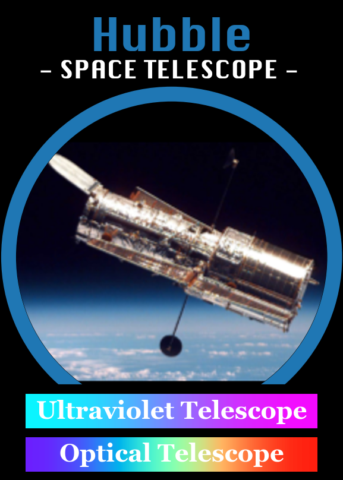
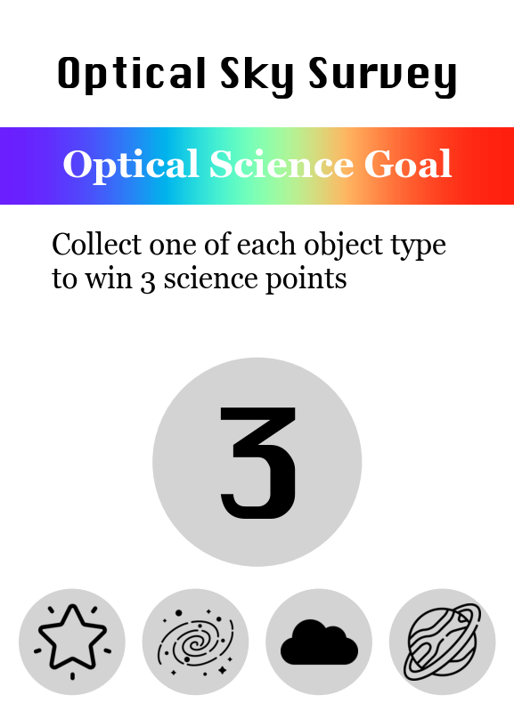
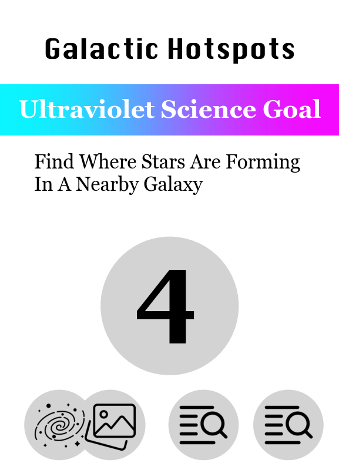
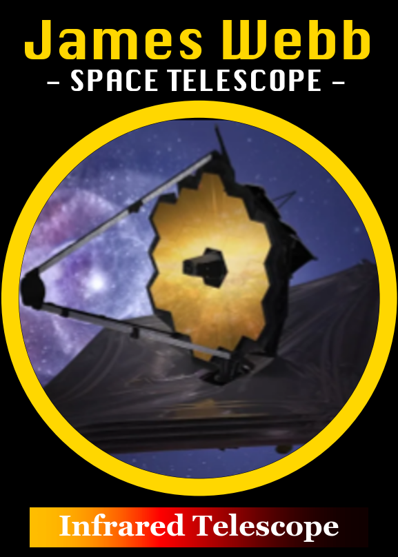
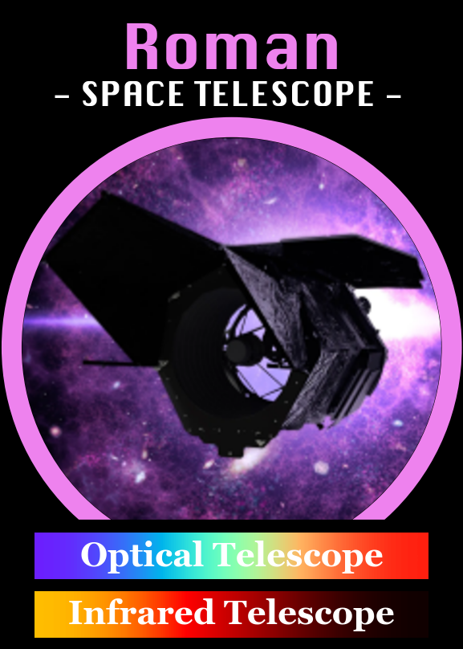
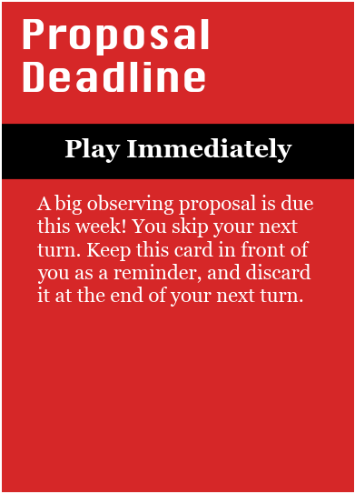

# MAST Match: The MAST Card Game

Welcome to the MAST Match project! MAST Match is an astronomical card game themed around the [Mikulski Archive for Space Telesopes (MAST)](https://archive.stsci.edu), the data archive which hosts all the data for the Hubble Space Telescope, the James Webb Space Telescope, and many other missions. This game features real astronomical data stored in the MAST archive and is fun for scientists, students, and the general public to play.

## !!! This project is still in playtest !!!
This game is still under development and is subject to change. More coming soon!  

### Print at Home

MAST Match is a **print at home** card game - available entirely for free as a PDF for you to print yourself at home! Click the links in the table below to download a PDF and print your own copy:

| PDF Link(s) | Description |
|:--------:|:--------|
|[MAST-Match_Collated.pdf](printable_pdf/MAST-Match_Collated.pdf)| Collated file with card fronts and backs in the same PDF on alternating pages. Recommended for printers capable of double-sided printing. |
|[MAST-Match_CardFronts.pdf](printable_pdf/MAST-Match_Collated.pdf) [MAST-Match_CardBacks.pdf](printable_pdf/MAST-Match_Collated.pdf)| Card fronts and backs split into individual PDFs for convienience. Recommended for printers which do not support double-sided printing.

Print these files on standard letter-sized (8.5"x11") paper at 100% scale. We recommend printing on cardstock paper for best results.

# How to Play

MAST Match is a competitive card game in which each player builds their own **data archive** by collecting astronomical observations using space telescopes!

The goal of the game is to make matching sets of **Observation Cards**, in order to complete your Science Goal Cards and earn points. Watch out though, because there's always a little chaos in astronomy - the unpredictable Chaos Cards can make or break your strategy! 

This file includes the instructions and rules for how to play MAST Match, describing the different types of cards and how play proceeds on each turn.

## Types of Cards

There are four types of cards in the MAST Match game:

Card Back Example | Card Front Example | Card Type and Description | 
:---------:|:--------:|:-------------------------------------|
||  | <h2>Observation Cards</h2> These cards represent astronomical data. They each have a "target type" and a "data type", similar to the suits and numbers of a classical card deck.|
||  |  <h2>Telescope Cards</h2> Telescope cards are used to collect observation cards and complete your science goals. They each have specific wavelength(s) they can observe in. |
| |  | <h2>Science Goal Cards</h2> These cards represent research projects each player is trying to complete to earn points. Each science goal requires a different combinaton of wavelength and Observation Cards to complete. | 
||  | <h2>Chaos Cards</h2> These cards add a little unpredictability to the game. Their effects can be good or bad, so use with caution! | 
||  |  <h2>Rules Cards</h2> Quick-reference cards to remind you of the rules, but not used in play |

### Observation Cards

The majority of the cards in the deck are *Observation Cards*, which represent astronomical data. Each card has two symbols on it which represent its *Target Type* and *Data Type*. 

- *Target Type* What type of astronomical object this card represents: galaxy, star, nebula, or planet.
-  *Data Type*: What type of data file this card represents: an image, a spectrum, a time series, or a catalog.

Target Types             |  Data Types
:-------------------------:|:-------------------------:
  |   |

Some example observation cards are displayed below:

Observation Card | Observation Card | Observation Card | Observation Card
:-------------------------:|:-------------------------:|:-------------------------:|:-------------------------:
  |    |   |  
Target Type: **Nebula**  |  Target Type: **Galaxy** |  Target Type: **Planet** |   Target Type: **Star**
Data Type: **Image**  |  Data Type: **Catalog** |  Data Type: **Timeseries** | Data Type: **Timeseries**

The goal of the game is to collect matches of different combinations of targets and data, which will earn you points for your Science Goal Cards.

### Science Goal Cards

Science Goal Cards are how you earn points towards winning the game. Each Science Goal Card is worth between 3-6 points, displayed in the center circle of the card. The requirements to complete the science goal are depicted on the bottom, using the same symbols of "Target Type" and "Data Type" as on the Observation Cards.

If the requirement symbols are not touching, they can be completed by separate cards. If the symbols are touching, you must use one card that has both requirements - for example, "The Dark Side" Science Goal shown below has to be completed using two Observation cards, which are both images of nebula. A spectrum of a nebula would NOT count towards this goal.

Each Science Goal also has a wavelength, which determines which telescope card must be used to gather the observations. For example, the "Optical Sky Survey" card has four symbols on it, one of each Target Type, and can be completed by collecting 4 observation cards with a telescope in play which has optical capabilities, such as the Hubble Space Telescope.

Some example Science Goal Cards are shown below.

Science Goal Card | Science Goal Card | Science Goal Card 
| :-------------:|:-------------:|:-------------:|
 |   |  
This card requires one of each target type to complete and is worth 3 points |  This card requires two cards to complete, both images of nebulae, and is worth 5 points. |  This card requires three cards to complete: one image of a galaxy, and any two other catalogs.

### Telescope Cards

The Telescope Cards allow you to gather data and collect an Observation Card to add to your archive. Each telescope card has particular wavelengths it can observe in, which are depicted on the card. When collecting data, the wavelength on the telescope card must match the wavelength of one of the science goals you are trying to complete.

Some example telescope cards are displayed below:

| Telescope Card | Telescope Card  | Telescope Card |
| :-------------:|:-------------:|:-------------:|
|   |     |  
HST can be used to complete *Optical* or *Ultraviolet* goals. |  JWST can be used to complete *Infrared* science goals.  |  Roman can be used to complete *Infrared* or *Optical* science goals. | 

### Chaos Cards

Chaos cards are bonus cards that add a little extra chaos to the game! Their effects can be good or bad, so only draw one if you're feeling lucky!

Chaos Cards say either "Play immediately" or "Play Later", as denoted on the card. "Play Immediately" cards take effect as soon as you draw them, and you should play them face-up in front of you immediately and read them aloud to the group and resolve the effects. "Play Later" cards can be read privately, and kept in your hand face-down until you decide to activate them. You can play a "Play Later" Chaos card at any time, even if it is not your turn. 

Some example chaos cards are displayed below:

Chaos Card | Chaos Card  | Chaos Card 
:-------------------------:|:-------------------------:|:-------------------------:
  |   |  

## Table Setup

### Pass out Science Goal Cards

Shuffle the Science Goal Cards and pass out 3 cards to each player, laying them face-up in front of each player. These will be your Science Goals to start.

Place the remaining deck face-down near the center of the table as a draw pile.

### Shuffle the Chaos Cards

Shuffle the Chaos Card deck and place it face-down near the center of the table.

### Set up the Visible Sky (Observation Cards)

Shuffle the Observation Cards and put the deck face-down near the center of the table. this will be the draw pile. Draw twice as many cards as there are players, and place them face-up in a row next to the Observation draw pile. This row of cards is called the Visible Sky, and represents which targets are visible in the night sky on a given turn. For example, in a 4-player game, there should be 8 cards in the Visible Sky Row.

| Number of Players | Number of Observation Cards in the Visible Sky |
|:-------------------------:|:-------------------------:|
| 2 Players | 4 | 
| 3 Players | 6 |
| 4 Players | 8 | 
| 5 Players | 10 | 
| 6 Players | 12 | 

At any point in the game, if none of the cards in the Visible Sky Row are applicable for any player's open Science Goals, you can discard the entire row and replace it with new cards.

### Set up the Telescope row

Choose which Telescope Cards you want to use in your game, using the table below as a guide. Place the telescope cards face-up in a row near the center of the table. Put the rest of the telescope cards back in the box.

The table below is a recommendation, but if you want to shake things up, feel free to pick out your own combination of telescopes! Just make sure you have at least one telescope each that can do Optical, Infrared, and Ultraviolet wavelengths.

| Number of Players | Number of Telescope Cards | Recommended Telescope Cards |
|:-------------------------:|:-------------------------:|:-------------------------|
| 2 Players | 3 | Hubble, James Webb, Roman
| 3 Players | 4 | Hubble, James Webb, Roman, Galex
| 4 Players | 5 | Hubble, James Webb, Roman, Galex, Tess
| 5 Players | 6 | Hubble, James Webb, Roman, Galex, Tess, IUE, Kepler,
| 6 Players | 7 | Hubble, James Webb, Roman, Galex, Tess, IUE, Kepler, Spitzer

### Setup Diagram

At the end of set up, the table should look something like this for a 4-player game:

 

Checklist: 
- Each player should have 3 science goals face-up in front of them. 
- In the center of the table, there should be 3 facedown draw piles (Chaos Cards, Observation Cards, and Science Goal Cards).
- There should be a number of Observation cards face-up next to the draw pile. The number of cards should be equal to twice the number of players.
- The telescope cards should be face-up near the center of the table.

## How to Win

The first player to earn **15 science points** by completing their Science Goal Cards wins the game.

## Starting the Game

Play starts with one player and proceeds counter-clockwise.

### Decide Who Goes First
Decide who will go first by answering an astronomy-themed question. You can use one of the example questions below, or come up with one yourself!

- Who has looked through a telescope most recently?
- Who can guess the current phase of the moon the closest?
- *[For Students]*: Who can name the most constellations?
- *[For Scientists]*: Who has most recently attended an astronomical conference?

## On your turn
On your turn, you can choose one of the following actions to play:

### 1. Pick a Telescope

Choose a telescope from the telescope row and place it face-up in front of you. On any of your next turns, you can use this telescope in the "Observing Phase" action. 

You can only have one telescope card at a time. If you do not use a telescope card within 3 turns, it goes back into the Telescope Row automatically.

### 2. Observe Data

If you have a Telescope Card in front of you, you can use it to collect an Observation Card from the Visible Sky Row and play it towards one of your Science Goals.

Choose an Observation Card from the Visible Sky Row, and place it face-up next to the Science Goal you are collecting it for. The wavelength of the Science Goal must match the wavelength of the Telescope Card. The symbols on the Observation card must match one or more of the requirements for the Science Goal.

Immediately replace the card you took from the Visible Sky with a new one from the draw pile, so the Visible Sky Row always has the same number of cards.

When you collect an observation, return the Telescope Card back into the Telescope Row. You must pick a telescope on your next turn before gathering another observation.

#### Completing a Science Goal

Whenever you complete a science goal, announce it to the other players and immediately draw a new Science Goal Card and place it in front of you. 

Once a Science Goal has been completed, the observations associated with that goal are immune to the effects of Chaos Cards and can no longer be traded or stolen.

There is no penalty for uncompleted science goals at the end of the game.

### 3. Draw a Chaos Card

If you cannot, or do not want to take the "Pick a Telescope" or "Observing Phase" actions, you can instead draw one card from the Chaos Card Deck. If you draw a "Play Immediately" card, read the effects out loud and resolve the card immediately. If you draw a "Play Later" card, you can keep it in your hand, secret from the other players, until whenever you decide to play it.

"Play Later" Chaos Cards can be played at any time, even if it is not your turn.

## Winning the Game

The first person to earn **15 science points** by completing their Science Goals (and/or getting bonus points from Chaos Cards) wins the game!

# Credits

MAST Match was created by a small team during a "Hack Day Event" focused on developing new Outreach materials for MAST.

## About MAST
The [Mikulski Archive for Space Telesopes (MAST)](https://archive.stsci.edu) is an astronomical data archive focused on the optical, ultraviolet, and near-infrared. MAST hosts data from over 20 missions including Webb, Hubble, TESS, Kepler, and in the future Roman.

## Image Credits
All of the images used in this game are real data from MAST! There are a few cards which feature artist's renditions, but still represent real data from NASA missions hosted at MAST. You can find all source images, learn more about them, and download full-resolution versions of the images at:

- http://hubblesite.org/
- https://webbtelescope.org/

This game features data from the HST, JWST, and GaLEX missions, obtained from the MAST data archive at the Space Telescope Science Institute, which is operated by the Association of Universities for Research in Astronomy, Inc., under NASA contract NAS 5–26555.

The icons in this game are from [Flaticon.com](https://www.flaticon.com) and used under the free for personal and commercial use Flaticon License.

### Have feedback or suggestions?

MAST Match is still in its playtest stage, so we're actively looking for things to improve! If you have questions, comments, feedback, or just want to share your experience playing the game, please reach out to jimig@stsci.edu !

